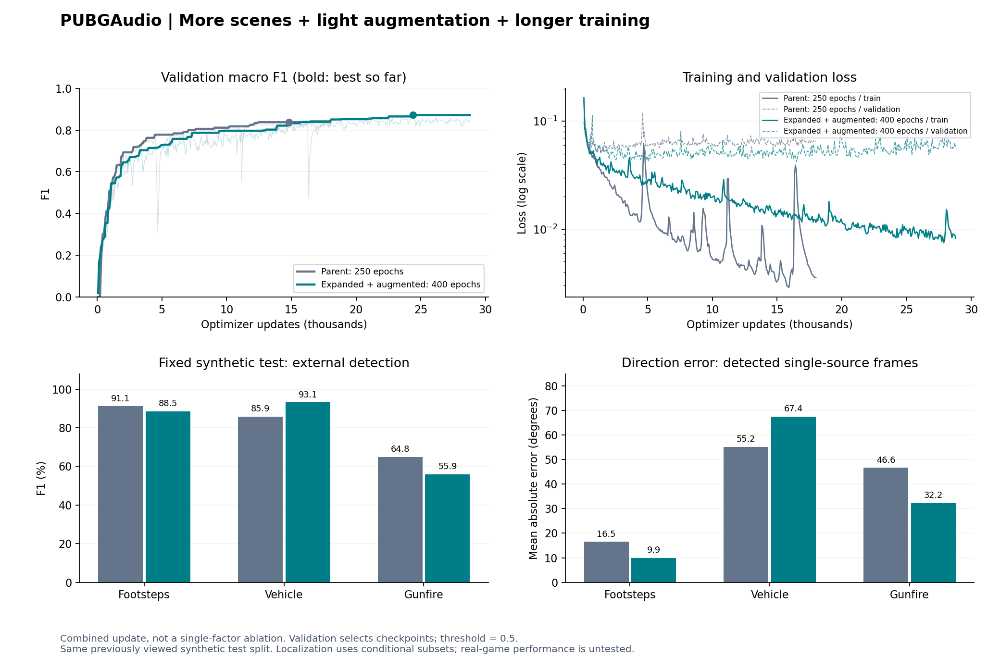

# 轻增强与枪声、车辆扩充训练结果（F034）

已完成400轮、28,800次参数更新。训练场景从48增至96段（96→192分钟），新增枪声/车辆为主的数据；启用每轮随机五秒裁剪和50%空间镜像。原有数据、验证/测试保持原样。

新增48段中有枪声230条、车辆140条、脚步70条轨迹，含15次车辆碰撞。全数据108段共3.6小时，362源家族/PCM分区核验及4段精确重放通过。

本次同时改变数据、增强和预算，是组合更新，不能将效果归因于某一项。沿用相同模型、损失、初始化种子、batch16和Adam固定学习率0.001。每轮从每个场景抽12个窗口，共1152次采样/72次更新；400轮比旧250轮多60%参数更新。

训练与验证循环累计36.4分钟，不含数据生成、缓存与最终测试。训练过程见[新W&B运行](https://wandb.ai/simonlynch-harbin-institute-of-technology/PUBGAudio/runs/e6f7b62b7263)。

## 检测模型：在相同固定合成测试集上复评

主要比较使用两个版本各自按最高外部验证宏平均F1保存的模型，阈值固定0.5。测试没有用于选轮次、权重或阈值。该测试集此前已查看，不是新盲测，也不是实战准确率。

W&B验证曲线的最后一个点不是最终测试结果。例如外部枪声：

| 指标 | 使用模型 | 外部枪声F1 |
|---|---:|---:|
| `validation/external/gunfire/f1`，最后一轮 | 第400轮 | 78.27% |
| `validation/external/gunfire/f1`，检测规则选中轮 | 第339轮 | 80.37% |
| `test_detection/external/gunfire/f1`，固定测试集 | 第339轮 | 55.91% |

验证枪型为M16A4，测试枪型为Kar98k，均与训练枪型家族隔离。此处80.37%→55.91%体现跨测试分布的泛化差距；不能把验证集上的0.7以上当成测试F1。另须区分`self`（自身）和`external`（外部）的枪声指标。

| 外部声音 | 父版250轮F1 | 本次400轮F1 | 变化（百分点） | 本次召回率 |
|---|---:|---:|---:|---:|
| 脚步 | 91.09% | 88.51% | -2.58 | 82.61% |
| 车辆 | 85.86% | 93.10% | +7.24 | 91.93% |
| 枪声 | 64.84% | 55.91% | -8.93 | 53.94% |
| 等权宏平均 | 80.60% | 79.18% | -1.42 | — |

本次车辆检测改善，但枪声漏检增加、脚步F1下降，宏平均F1也下降。不能称为全面优于父版，旧模型保留。测试使用训练未见的枪型/车辆家族；验证提升没有完全迁移到测试，单凭这次组合实验不能判定是增强、分布比例还是训练预算造成。

| 自身声音 | 父版F1 | 本次F1 | 本次召回率 |
|---|---:|---:|---:|
| 脚步 | 93.94% | 98.47% | 98.10% |
| 车辆 | 98.76% | 99.26% | 99.81% |
| 枪声 | 81.34% | 77.98% | 64.39% |

## 方向与距离

以下只统计已检出的单声源帧；两次参与统计的帧数可能不同，需结合上面的召回率。距离是未实录标定的合成单位，不能称为米级精度。

| 外部声音 | 方向MAE：旧→新（°） | 距离MAE：旧→新（合成单位） | 定位帧数：旧→新 |
|---|---:|---:|---:|
| 脚步 | 16.50 → 9.90 | 11.21 → 8.40 | 273 → 235 |
| 车辆 | 55.16 → 67.40 | 25.70 → 25.10 | 672 → 774 |
| 枪声 | 46.63 → 32.25 | 24.75 → 14.72 | 153 → 128 |

## 两种预先确定的选模规则

| 运行 | 规则 | 选中轮次 | 验证loss | 验证宏F1 | 测试宏F1 |
|---|---|---:|---:|---:|---:|
| 父版250轮 | 最低总验证loss | 19 | 0.051983 | 58.48% | 57.61% |
| 父版250轮 | 最高外部验证宏F1 | 206 | 0.058329 | 83.81% | 80.60% |
| 扩充增强400轮 | 最低总验证loss | 229 | 0.042068 | 84.14% | 81.61% |
| 扩充增强400轮 | 最高外部验证宏F1 | 339 | 0.062136 | 87.17% | 79.18% |

保留`best.pt`及`best_detection.pt`，分别导出`model.pt`与`model_detection.pt`。表格没有根据测试结果在两种规则之间另选最优模型。
另一条预定规则（总验证损失最低，第229轮）得到脚步/车辆/枪声测试F1：85.94% / 90.90% / 68.00%。两种规则的效果差异一并保留，不用测试结果回头更改选模标准。

- [检测验证最优模型，第339轮](../train-light-v5_3-gunvehicle-aug400-20260907/model_detection.pt)
- [总验证损失最优模型，第229轮](../train-light-v5_3-gunvehicle-aug400-20260907/model.pt)
- 新数据目录：`datasets/light-v5_3-gunvehicle-20260907`
- 具体生成概率、源家族限制、增强标签同步及复现命令：[F034规范](../../docs/light_augmentation_gunvehicle_v5_3.md)。

新数据仍只含脚步、车、枪与自身角色/碰撞；未包含完整身体动作、投掷物、天气及实录分布。未额外加噪、调增益或做频谱遮挡，网络仍为五秒离线上下文。音量/声卡标定、实时接入和真实游戏效果尚未验证。
