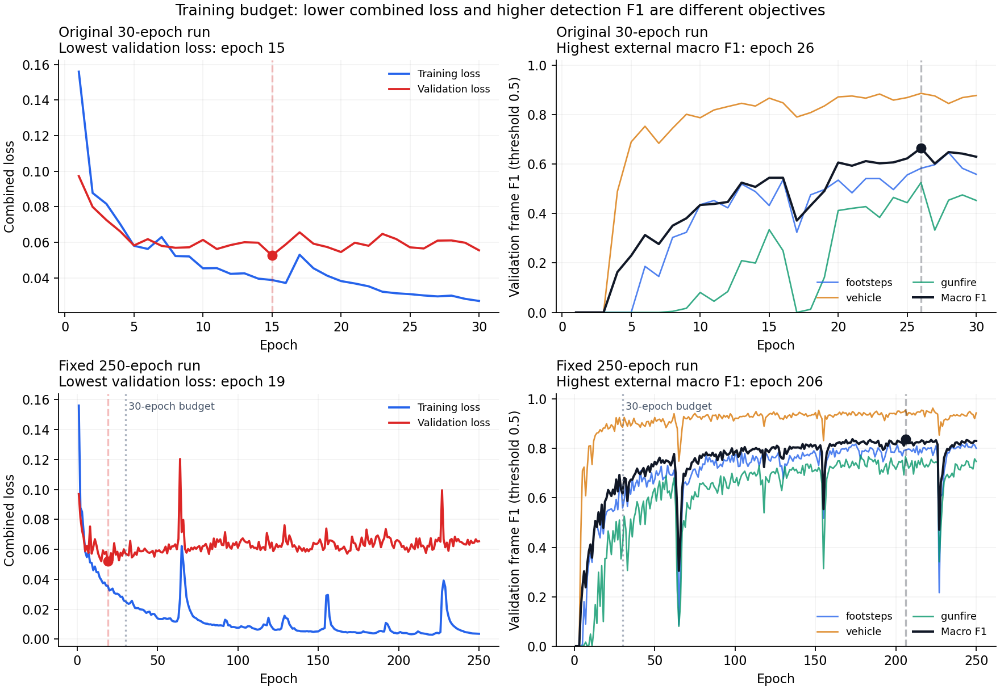

# 30轮与250轮训练对照（F032）

已完成250轮训练。下面的30轮截面与250轮结果来自同一次初始化和优化轨迹；前30轮权重在第30轮结束时冻结，因此训练轮数的比较不混入两次GPU运行的差异。

原先的30轮运行仍保留，验证总损失的最佳轮为15，但检测宏平均F1在第26轮仍有提高。提前停止偏保守的证据及论文250轮/75轮patience见[轮数复查](../../docs/training_budget_review.md)。

## 对照设置

- 同一2小时轻量合成数据，训练/验证/测试96/12/12分钟；362个源文件按家族及PCM隔离。
- 同一约106万参数论文骨干、损失、batch16、Adam固定学习率0.001和种子202609077。未新增数据增强或学习率调度。
- 每轮1,152个五秒训练裁剪、72次更新。250轮共18,000次更新；重复暴露400小时，不等于新增400小时独立数据。
- 显式关闭提前停止，完整跑250轮；该固定预算设置不同于论文的75轮patience。
- 两种选模规则在测试前固定：总验证损失最低、外部三类验证宏平均F1最高。阈值固定0.5；不用测试结果更改选模。
- 测试集与上一轮相同，属于复用既有测试划分，不是新的盲测集。每个不同权重仅做一次本次测试；预算之间若checkpoint哈希相同，复用同一份评估。
- 训练及逐轮验证合计1247.6秒，不含缓存准备、初始化、最终测试及同步。

## 同一次训练的预算截面（仅验证集）

| 最多训练轮数 | 最低损失所在轮 | 最低验证损失 | 最高检测F1所在轮 | 最高检测宏平均F1 |
|---|---:|---:|---:|---:|
| 10 | 9 | 0.057099 | 10 | 41.17% |
| 30 | 19 | 0.051983 | 28 | 69.31% |
| 50 | 19 | 0.051983 | 50 | 74.61% |
| 80 | 19 | 0.051983 | 62 | 77.78% |
| 100 | 19 | 0.051983 | 98 | 80.06% |
| 150 | 19 | 0.051983 | 142 | 81.78% |
| 200 | 19 | 0.051983 | 173 | 83.77% |
| 250 | 19 | 0.051983 | 206 | 83.81% |

总损失与检测F1是不同目标。更多轮数不会保证每一轮或每一个输出都更好；上表记录预算以内的最佳值，不是最后一轮的值。

## 测试结果：外部声音

| 预算 | 验证集选模规则 | 选中轮次 | 脚步F1 | 车辆F1 | 枪声F1 | 三类宏平均F1 |
|---|---|---:|---:|---:|---:|---:|
| 30 | 总验证损失最低 | 19 | 74.06% | 72.88% | 25.87% | 57.61% |
| 30 | 验证检测宏平均F1最高 | 28 | 69.57% | 79.87% | 44.31% | 64.58% |
| 250 | 总验证损失最低 | 19 | 74.06% | 72.88% | 25.87% | 57.61% |
| 250 | 验证检测宏平均F1最高 | 206 | 91.09% | 85.86% | 64.84% | 80.60% |

相同检测选模规则下，30轮到250轮的测试宏平均F1由64.58%变为80.60%，变化+16.02个百分点。总损失规则在30/250轮预算内分别选择第19/19轮；增加训练轮数必须配合合适的选模目标。

验证检测F1在200轮预算内最高83.77%，250轮预算内最高83.81%，后50轮最佳值增加约0.05个百分点。是否继续增加预算应结合这条曲线；结论仅针对这一个种子和这批合成数据，不应预设1000轮为必要门槛。

F1为100ms帧级检测指标，不是准确率或官方SELD分数。同类三条ADPIT轨取最大活动向量模长；重复轨不计作多个正确检出。

| 预算 / 规则 | 脚步召回 | 车辆召回 | 枪声召回 | 自身脚步F1 | 自身车F1 | 自身枪F1 |
|---|---:|---:|---:|---:|---:|---:|
| 30 / 总验证损失最低 | 60.00% | 58.95% | 15.35% | 89.99% | 98.71% | 82.89% |
| 30 / 验证检测宏平均F1最高 | 64.93% | 72.96% | 29.88% | 85.98% | 98.94% | 84.53% |
| 250 / 总验证损失最低 | 60.00% | 58.95% | 15.35% | 89.99% | 98.71% | 82.89% |
| 250 / 验证检测宏平均F1最高 | 93.33% | 81.52% | 63.90% | 93.94% | 98.76% | 81.34% |

## 条件定位诊断

| 预算 / 规则 | 声音 | 已检出的单声源帧 | 方向MAE | 距离MAE（合成单位） |
|---|---|---:|---:|---:|
| 30 / 总验证损失最低 | 脚步 | 170 | 23.57° | 11.51 |
| 30 / 总验证损失最低 | 车辆 | 483 | 49.40° | 35.81 |
| 30 / 总验证损失最低 | 枪声 | 37 | 29.66° | 17.59 |
| 30 / 验证检测宏平均F1最高 | 脚步 | 186 | 30.25° | 9.29 |
| 30 / 验证检测宏平均F1最高 | 车辆 | 609 | 60.94° | 47.67 |
| 30 / 验证检测宏平均F1最高 | 枪声 | 72 | 45.21° | 14.13 |
| 250 / 总验证损失最低 | 脚步 | 170 | 23.57° | 11.51 |
| 250 / 总验证损失最低 | 车辆 | 483 | 49.40° | 35.81 |
| 250 / 总验证损失最低 | 枪声 | 37 | 29.66° | 17.59 |
| 250 / 验证检测宏平均F1最高 | 脚步 | 273 | 16.50° | 11.21 |
| 250 / 验证检测宏平均F1最高 | 车辆 | 672 | 55.16° | 25.70 |
| 250 / 验证检测宏平均F1最高 | 枪声 | 153 | 46.63° | 24.75 |

需要逐项对照方向、距离与自身类别的结果，不能把外部检测的改善概括成所有任务都更好。

定位误差只针对已检出的单声源帧，模型之间的统计样本可能不同，必须同时看召回率。距离尚未实录标定，不能称为米级精度；未验证真实游戏、跨音量或跨声卡效果。

## 曲线与文件

- [W&B完整曲线](https://wandb.ai/simonlynch-harbin-institute-of-technology/PUBGAudio/runs/06d00717d476)；总损失选模测试在`test/*`，检测选模测试在`test_detection/*`。
- 本次运行：`outputs/train-light-v5_3-250epochs-20260907`；两类训练checkpoint为`best.pt`和`best_detection.pt`。
- 导出的推理权重分别为`model.pt`和`model_detection.pt`；保留配置、归一化和选模依据，不包含优化器。
- `budget_30`保存同一运行的30轮权重及其测试结果；旧30轮运行未改动。
- `training_source_identity.json`及`source_snapshot`记录本轮实际训练代码，`metrics.jsonl`保存逐轮原始值。
- 本报告旁的同名JSON保留完整测试指标与检查记录。没有扩大网络或重新生成数据。
